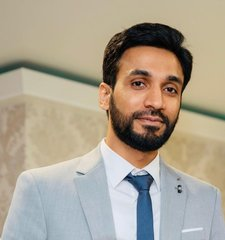

# Muhammad Fawad Rafique

> *"Yesterday I was clever so I wanted to change the world. Today I am wise so I wanted to change myself." -Rumi*

### Junior Web Developer at [BeCode.org](https://becode.org/)

| | |
|-|:-:|
| Birthday | 19-October |
|Favourite color| Grey |
| Favourite food | Biryani |
|Pineapple on pizza | <ul><li>[ ] Yes</li><li>[x] No</li></ul> |

### Hobbies

* Reading
* Playing cricket
* Electronics tinkering
    * Internet of Things
    * Laser cutter and 3D printer etc

 ### You can always count on me when there is a technical problem with your laptop and organizing a hackathon... 
 I am open to any type of collaboration that could help us in our learning phase as a web developer. 

 ### A funny story
During my first week of arrival in Belgium, I went to attend an info session in a college in Gent. When I went to use the bathroom, there I saw two doors without any public signs but with "HEREN" and "DAMES" labels. I didn't know what those words mean, so I thought as Nederlands has some similarity with English maybe Heren is from Her, and this is for meant for females. So, I went inside the "DAMES" there was nobody. I used the toilet when I was going to wash my hands, a woman entered the bathroom. At that moment, I came to know I entered the wrong side.

 ### TL;DR
Google translate can save you from potential embarrassment.

 :arrow_backward: [Previous - EZGI](https://github.com/ezgihendrickx/markdown-challenge/blob/master/README.md) || MUHAMMAD FAWAD RAFIQUE || [Next - GERRIT](https://github.com/degenge/markdown-challenge/blob/master/README.md) :arrow_forward: